<div class="title-slide-content">
  <div class="title-text">
    <h1>Building AI Agents in Typescript using the AI-SDK</h1>
    <p class="subtitle">From chatbots to autonomous code reviewers</p>
    <p class="date">February 2026</p>
  </div>
</div>

<!--
Welcome everyone! Today we're going to go from "what even is an agent?" all the way to building a working PR review agent in TypeScript.

Whether you're a TS dev who's curious about AI, or you've built agents before and want to see the AI-SDK approach — there's something here for you.

By the end, you'll have real code you can take home and run.
-->

---
layout: center
---

# What is an Agent?

> A system that uses an LLM to decide **what actions to take** and **in what order**, iterating until a goal is met.

<!--
Let's start with the fundamental question. What actually IS an agent?

At its core, an agent is a system that uses a language model not just to generate text, but to make decisions. It decides what to do, does it, looks at the result, and keeps going until the job is done.

This is the key distinction from a simple chatbot — an agent has autonomy over its workflow.
-->

---

# The Three Pillars of an Agent

<v-clicks>

🧠 **Model** — The reasoning engine (GPT, Claude, Llama...)

🔧 **Tools** — Functions the model can call (read files, query APIs, execute code...)

🔁 **Loop** — The orchestration cycle: observe → decide → act → repeat

</v-clicks>

<!--
Every agent is built on three pillars.

[click] First, the MODEL. This is the brain — it reasons about what to do next. Could be GPT, Claude, Llama, whatever.

[click] Second, TOOLS. These are the hands. Functions the model can invoke to interact with the world. Reading files, calling APIs, running tests — anything you can write as a function.

[click] Third, the LOOP. This is what makes it an agent and not just a one-shot call. The model observes the current state, decides what tool to use, acts, and then loops back to observe the result. It keeps going until the task is done.
-->

---

# The Agent Loop

```mermaid
flowchart LR
  A[🔍 Observe] --> B[🧠 Decide]
  B --> C[⚡ Act]
  C --> D{Done?}
  D -->|No| A
  D -->|Yes| E[✅ Return Result]
```



<br>

The model is **in the driver's seat** — it decides when to stop.

<!--
Here's the loop visually. Observe the current state, decide what tool to call, act by calling it, then check — are we done?

The crucial insight is that the MODEL decides when to stop. Not your code, not a fixed number of iterations. The model reasons about whether the goal has been achieved.

This is what gives agents their power — and what makes them unpredictable in interesting ways.
-->

---

# Chatbot vs Pipeline vs Agent

| | Chatbot | Pipeline | Agent |
|---|---------|----------|-------|
| <v-click at="1">**Control flow**</v-click> | <v-click at="1">User-driven</v-click> | <v-click at="1">Developer-defined</v-click> | <v-click at="1">Model-driven</v-click> |
| <v-click at="2">**Tool use**</v-click> | <v-click at="2">None / basic</v-click> | <v-click at="2">Fixed sequence</v-click> | <v-click at="2">Dynamic selection</v-click> |
| <v-click at="3">**Iterations**</v-click> | <v-click at="3">1 turn</v-click> | <v-click at="3">N fixed steps</v-click> | <v-click at="3">Until goal met</v-click> |
| <v-click at="4">**Example**</v-click> | <v-click at="4">FAQ bot</v-click> | <v-click at="4">RAG chain</v-click> | <v-click at="4">PR reviewer</v-click> |

<!--
Let me draw a clear line between these three patterns, because the terms get thrown around loosely.

[click] A chatbot's control flow is driven by the user — you send a message, you get a response. A pipeline is developer-defined — you hardcode the steps. An agent? The model drives the flow.

[click] Tool use follows the same pattern. Chatbots rarely use tools. Pipelines use tools in a fixed sequence you designed. Agents pick tools dynamically based on what they observe.

[click] Iterations — chatbots do one turn, pipelines do N predetermined steps, agents keep going until the goal is met.

[click] Concrete examples: a FAQ bot is a chatbot, a RAG chain is a pipeline, and the PR reviewer we're building today is an agent.
-->

---
layout: section
---

# Let's Build

Time to write some code.


<!--
Alright, enough theory. Let's get our hands dirty.

First up — the toolkit we'll use: the Vercel AI SDK.
-->

---
layout: center
---

# The AI SDK

Open-source TypeScript toolkit by Vercel for building AI applications

<br>

**One API, many providers** — swap models without changing your code

<!--
The AI SDK is an open-source library from Vercel that gives you a unified interface for working with LLMs.

The killer feature: provider abstraction. You write your code once, and you can swap between OpenAI, Anthropic, Google, or any other provider without changing your application logic.

This matters a lot for agents, because you might want to use different models for different tasks, or switch providers based on cost and performance.
-->

---
layout: two-cols
class: no-decoration
---

# Provider Abstraction

::left::

### OpenRouter

```ts {all|2-3|5-8}
import { createOpenRouter }
  from '@openrouter/ai-sdk-provider';

const openrouter = createOpenRouter({
  apiKey: process.env.OPENROUTER_API_KEY,
});

const result = await generateText({
  model: openrouter(
    'openai/gpt-oss-120b:free'
  ),
  prompt: 'Explain TypeScript generics',
});
```

::right::

### Anthropic

```ts {all|2|4-7}
import { anthropic }
  from '@ai-sdk/anthropic';


const result = await generateText({
  model: anthropic('claude-sonnet-4-5-20250929'),
  prompt: 'Explain TypeScript generics',
});
```

<br>

<v-click>

**Same `generateText`, different provider.**

</v-click>

<!--
Here's what I mean by provider abstraction.

On the left, we're using OpenRouter — which gives us access to hundreds of models through a single API. We create an OpenRouter provider and pass it to generateText.

On the right, same call, same generateText function — but now we're using Anthropic's Claude directly.

[click] The point is: your application logic stays the same. Only the model line changes.

For our demo today, we'll use OpenRouter with a free GPT model for Approach A, and Claude Code for Approach B.
-->

---
class: no-decoration
---

# `generateText` — The Core Primitive

```ts {all|2|3|4|5|6-7}
const result = await generateText({
  model: openrouter('openai/gpt-oss-120b:free'),  // ← Which model
  system: 'You are a helpful assistant.',           // ← System prompt (persona)
  prompt: 'What files changed in this PR?',         // ← User prompt
  tools: { fetchPR, listFiles },                    // ← Available tools
  stopWhen: stepCountIs(5),                         // ← Stop condition
});
```

<br>

<v-clicks>

- `result.text` — final text response
- `result.steps` — array of every tool call + result
- `result.usage` — token counts

</v-clicks>

<!--
generateText is the workhorse function. Let's break it apart.

[click] First, which model to use.
[click] System prompt — this is where you define the persona and rules.
[click] User prompt — the actual task.
[click] Tools — an object of tools the model can call. We'll define these in a moment.
[click] stopWhen — this is what enables the agent loop. It sets a condition for when to stop. stepCountIs(5) means "stop after 5 tool-call rounds." Without a stop condition, the model makes one call and stops.

[click] The result gives you the final text...
[click] ...an array of every step taken (every tool call and its result)...
[click] ...and token usage stats.
-->

---
class: no-decoration
---

# System Prompts as Policy

```ts {all|2|3-4|5-6|7-8}
const system = `You are a senior code reviewer.
Focus on correctness, security, performance, and readability.
Be constructive — suggest fixes, not just problems.
Praise good patterns when you see them.
Keep reviews concise but thorough.
Format output as markdown.`;

const { text } = await generateText({
  model,
  system,
  prompt: `Review this PR: ${prUrl}`,
});
```

<br>

> The system prompt is the **policy layer** — it shapes _how_ the agent behaves, not _what_ it does.

<!--
System prompts deserve their own slide because they're more important than people realize.

For agents, the system prompt isn't just flavor text. It's your policy layer. It defines HOW the agent behaves — its priorities, its constraints, its style.

[click] We declare the role — senior code reviewer.
[click] We set priorities — correctness, security, performance, readability.
[click] We set the tone — constructive, not just critical.
[click] We set constraints — concise, thorough, markdown.

Think of it as the agent's "constitution." Every decision the model makes runs through this filter.
-->

---
class: no-decoration
---

# Defining Tools with `tool()`

```ts {all|1|2|3-5|6-9}
const readFileTool = tool({
  description: 'Read contents of a file at a given path',
  inputSchema: z.object({
    path: z.string().describe('Absolute path to file'),
  }),
  execute: async ({ path }) => {
    const content = await fs.readFile(path, 'utf-8');
    return { content };
  },
});
```

<v-clicks>

- **`description`** — tells the model _when_ to use this tool
- **`inputSchema`** — Zod schema → validated & typed automatically
- **`execute`** — the actual function that runs

</v-clicks>

<!--
Now let's look at how you define a tool for the AI SDK.

[click] Every tool starts with the tool() helper.
[click] The description is critical — this is what the model reads to decide whether to call this tool. Write it like documentation for the AI.
[click] inputSchema uses Zod schemas. The SDK extracts the JSON schema from Zod and sends it to the model. When the model calls the tool, the input is validated and fully typed.
[click] Execute is your actual implementation — it receives the validated, typed parameters.

[click] Three parts: description tells the model WHEN...
[click] ...inputSchema tells it WHAT to pass...
[click] ...and execute is the WHAT HAPPENS.
-->

---
layout: two-cols-header
---

# Tool Categories — A Mental Model

::left::

### 📖 Read
- `readFile` — read source code
- `fetchPR` — get PR metadata
- `searchCode` — find patterns

### ✏️ Write
- `writeFile` — create/edit files
- `postReview` — submit a review
- `createIssue` — open an issue

::right::

### 🔍 Analyze
- `parseAST` — understand structure
- `diffFiles` — compare changes
- `checkTypes` — run type checker

### ⚡ Execute
- `runTests` — execute test suite
- `runLint` — run linter
- `buildProject` — compile the code

<!--
When designing tools for your agent, it helps to think in categories.

Read tools gather information — reading files, fetching data, searching code.

Write tools make changes — creating files, posting reviews, opening issues.

Analyze tools reason about code — parsing ASTs, computing diffs, checking types.

Execute tools run processes — tests, linters, builds.

A well-designed agent typically needs tools from at least two categories. Our PR reviewer needs Read (fetch PR data) and Write (post a review).
-->

---
class: no-decoration
---

# Custom Tools in Action

```ts {all|1-8|10-19}
const listFilesTool = tool({
  description: 'List all files in a directory',
  inputSchema: z.object({
    dir: z.string().describe('Directory path'),
  }),
  execute: async ({ dir }) => {
    const files = await fs.readdir(dir, { recursive: true });
    return { files: files.filter(f => !f.includes('node_modules')) };
  },
});

const runTestsTool = tool({
  description: 'Run the test suite and return results',
  inputSchema: z.object({
    testPath: z.string().optional().describe('Specific test file to run'),
  }),
  execute: async ({ testPath }) => {
    const cmd = testPath ? `npx vitest ${testPath}` : 'npx vitest --run';
    const { stdout } = await execAsync(cmd);
    return { output: stdout };
  },
});
```

<!--
Here are two concrete tools: one Read tool and one Execute tool.

[click] listFiles reads a directory recursively — notice we filter out node_modules. Always think about what the model doesn't need to see.

[click] runTests executes vitest. The model can optionally pass a specific test file, or run the whole suite. The result goes back to the model so it can reason about pass/fail.

These are simple, focused tools. That's the goal — each tool should do one thing well.
-->

---
class: no-decoration
---

# Wiring Tools into the Agent

```ts {all|5|6|7}
const { text, steps } = await generateText({
  model: openrouter('openai/gpt-oss-120b:free'),
  system: 'You are a senior code reviewer...',
  prompt: `Review this PR: ${prUrl}`,
  tools: { fetchPR: fetchPRTool, postReview: postReviewTool },
  stopWhen: stepCountIs(5),
});

console.log(`Completed in ${steps.length} steps`);
console.log(text);
```

<br>

<v-clicks>

- **`tools`** — object of named tools the model can invoke
- **`stopWhen: stepCountIs(5)`** — allows up to 5 tool-call → result rounds
- The model chooses which tools to call, in what order, and when to stop

</v-clicks>

<!--
Here's how it all comes together. We pass our tools as a named object, and set a stop condition.

[click] The tools property is a dictionary — keys become the tool names the model sees.
[click] stopWhen: stepCountIs(5) means the agent can make up to 5 round trips of tool calls and results. This is your safety valve.
[click] And here's the agent magic — the model decides everything else. Which tools to call, what order, what parameters, and when to stop.

In our case, the model will typically: 1) call fetchPR to get the diff, 2) analyze it, 3) call postReview to submit the review. Two tool calls, three steps total.
-->

---

# The Tool Loop in Detail


<!--
Let me walk through the sequence diagram.

The user calls generateText. The SDK sends the conversation plus tool definitions to the model.

The model decides to call a tool — it returns a tool_call with the name and arguments. The SDK validates the arguments against your Zod schema, then calls your execute function.

The result goes back to the model as a tool_result message. The model can then make another tool call, or decide it's done and return a final text response.

This loop continues until the model stops calling tools, or the stopWhen condition is met.

The SDK handles all of this orchestration for you. You just define tools and set a stop condition.
-->

---
class: no-decoration
---

# Loop Control — `stopWhen` and `prepareStep`

```ts {all|6|7-17}
const { text } = await generateText({
  model,
  system: 'You are a code review agent...',
  prompt: `Review PR: ${prUrl}`,
  tools: { fetchPR, analyzeCode, postReview },
  stopWhen: stepCountIs(10),
  prepareStep: ({ steps, stepNumber }) => {
    // Phase 1: only allow reading
    if (stepNumber <= 3) {
      return { toolChoice: { type: 'auto' },
        tools: { fetchPR } };
    }
    // Phase 2: analyze + write
    return { toolChoice: { type: 'auto' },
      tools: { analyzeCode, postReview } };
  },
});
```

<v-clicks>

- **`stopWhen`** — flexible stop conditions (`stepCountIs`, `hasToolCall`, or custom)
- **`prepareStep`** — dynamically control which tools are available per step

</v-clicks>

<!--
You can get more sophisticated with loop control.

[click] stopWhen is your stop condition. stepCountIs(10) means "stop after 10 rounds." You can also use hasToolCall('done') to stop when a specific tool is called, or write your own custom condition.

[click] prepareStep is more interesting — it's a callback that runs before each step, and you can dynamically change which tools are available.

Here we're implementing phased tool access: in the first 3 steps, the agent can only read data. After that, it can analyze and write. This is a pattern I really like — it forces the agent to gather information before acting.

Think of it as guardrails. You're not taking away the agent's autonomy, you're just guiding its workflow.
-->

---
class: no-decoration
---

# `generateObject` — Structured Output

```ts {all|2-8|9}
const { object: review } = await generateObject({
  model,
  schema: z.object({
    summary: z.string().describe('One paragraph overview'),
    issues: z.array(z.object({
      severity: z.enum(['critical', 'warning', 'suggestion']),
      file: z.string(),
      line: z.number().optional(),
      description: z.string(),
      suggestedFix: z.string().optional(),
    })),
    verdict: z.enum(['approve', 'request_changes', 'comment']),
  }),
  prompt: `Review this diff:\n${diff}`,
});
```

<v-click>

Returns a **fully typed, validated object** — not just text you have to parse.

</v-click>

<!--
One more core primitive: generateObject. Instead of getting back free-form text, you get a structured, typed object.

[click] You define a Zod schema for exactly the shape you want. Here we want a summary, an array of issues with severity/file/line/description, and a verdict.

[click] The result is a fully typed TypeScript object. No parsing, no regex, no hoping the model formatted things correctly.

This is incredibly powerful for agents. You can use generateObject to make structured decisions, extract data, or produce machine-readable output that feeds into the next step.
-->

---
layout: section
---

# Let's Put It All Together

Building the PR Review Agent


<!--
Alright, we've got our building blocks — generateText, tools, the agent loop, and structured output.

Time to build something real. Let's create a PR review agent.
-->

---
layout: center
---

# The PR Review Agent

**Parse. Reason. Review.**

<br>

A TypeScript agent that:
1. Takes a GitHub PR URL
2. Fetches the full PR context
3. Analyzes every file change
4. Posts a structured code review

<!--
Here's what we're building. The PR review agent takes a GitHub URL, fetches everything about the PR — the diff, the description, existing comments — reasons about the code changes, and posts a thorough review.

We'll build it two ways. First with custom tools and OpenRouter, then with Claude Code provider and built-in tools.
-->

---

# Architecture


<!--
Here's the architecture. We start with a PR URL, parse out the owner, repo, and PR number.

Then we enter the agent loop. Depending on which approach we're using, the agent either calls a custom fetchPR tool, or gets the context directly.

The LLM reasons about the code, potentially looping back for more information, and eventually generates and posts the review.

Both approaches end up at the same place — a review on your PR. The difference is HOW they get there.
-->

---
class: no-decoration
---

# Step 1: Parse the PR URL

```ts
export function parsePRUrl(url: string) {
  const match = url.match(
    /github\.com\/([^/]+)\/([^/]+)\/pull\/(\d+)/
  );
  if (!match) throw new Error(`Invalid PR URL: ${url}`);

  return {
    owner: match[1],
    repo: match[2],
    pull_number: Number(match[3]),
  };
}
```

```ts
parsePRUrl('https://github.com/vercel/ai/pull/42')
// → { owner: 'vercel', repo: 'ai', pull_number: 42 }
```

<!--
First, a simple utility to parse GitHub PR URLs. Regex extracts the owner, repo, and pull number.

Nothing AI-related here — just good old string parsing. But it's important because it turns a human-friendly URL into structured data our tools can use.
-->

---
class: no-decoration
---

# Step 2: Fetch PR Context with Octokit

```ts {all|1-4|6-10|12-21}
export async function getPRContext(
  owner: string, repo: string, pull_number: number
) {
  const octokit = new Octokit({ auth: process.env.GITHUB_TOKEN });

  const [pr, files, comments] = await Promise.all([
    octokit.pulls.get({ owner, repo, pull_number }),
    octokit.pulls.listFiles({ owner, repo, pull_number }),
    octokit.pulls.listReviewComments({ owner, repo, pull_number }),
  ]);

  return {
    title: pr.data.title,
    body: pr.data.body,
    author: pr.data.user?.login,
    files: files.data.map(f => ({
      filename: f.filename,
      status: f.status,
      patch: f.patch?.slice(0, 3000),  // Truncate large diffs
    })),
    existingComments: comments.data.map(c => ({
      path: c.path, body: c.body, author: c.user?.login,
    })),
  };
}
```

<!--
Step two: fetch everything about the PR using Octokit, GitHub's official SDK.

[click] We take owner, repo, and pull number — the output of parsePRUrl.

[click] Three parallel API calls — get the PR metadata, list changed files, and list existing review comments. Promise.all makes this fast.

[click] We return a clean object with just what the model needs. Notice we truncate patches to 3000 characters — this is important for token management. Large diffs can blow through your context window.

Also notice we include existing comments. This lets the agent avoid duplicating feedback that's already been given.
-->

---
class: no-decoration
---

# Approach A: Custom Zod Tools

```ts {all|1-9|11-22}
export const fetchPRTool = tool({
  description: 'Fetch full context for a GitHub PR',
  inputSchema: z.object({
    prUrl: z.string().describe('Full GitHub PR URL'),
  }),
  execute: async ({ prUrl }) => {
    const { owner, repo, pull_number } = parsePRUrl(prUrl);
    return getPRContext(owner, repo, pull_number);
  },
});

export const postReviewTool = tool({
  description: 'Post a review on a GitHub pull request',
  inputSchema: z.object({
    prUrl: z.string().describe('Full GitHub PR URL'),
    body: z.string().describe('Review body in markdown'),
    event: z.enum(['APPROVE', 'REQUEST_CHANGES', 'COMMENT'])
      .default('COMMENT'),
  }),
  execute: async ({ prUrl, body, event }) => {
    const { owner, repo, pull_number } = parsePRUrl(prUrl);
    return postReview(owner, repo, pull_number, body, event);
  },
});
```

<!--
For Approach A, we wrap our helper functions as AI SDK tools.

[click] fetchPRTool takes a PR URL, parses it, and returns the full context. The model calls this tool when it needs to understand what the PR contains.

[click] postReviewTool takes a URL, a markdown body, and a review event type — APPROVE, REQUEST_CHANGES, or COMMENT. The model calls this when it's ready to post its review.

Notice the pattern: each tool has a clear description, Zod-validated inputSchema, and a focused execute function. The model reads the descriptions and schemas to figure out when and how to use them.
-->

---
class: no-decoration
---

# Approach A: Running the Agent

```ts {all|1-3|5-14|12}
const openrouter = createOpenRouter({
  apiKey: process.env.OPENROUTER_API_KEY,
});

const { text, steps } = await generateText({
  model: openrouter('openai/gpt-oss-120b:free'),
  system: `You are a senior code reviewer.
    Focus on correctness, security, and readability.
    Be constructive — suggest fixes, not just problems.`,
  prompt: `Review this pull request: ${prUrl}
    First, fetch the PR context using the fetchPR tool.
    Then analyze the changes and post your review.`,
  tools: { fetchPR: fetchPRTool, postReview: postReviewTool },
  stopWhen: stepCountIs(5),
});
```

<v-click>

**What happens:** Model calls `fetchPR` → analyzes diff → calls `postReview` → done.

</v-click>

<!--
Here's the complete Approach A agent. Three lines of setup, then one generateText call.

[click] Create the OpenRouter provider — we're using gpt-oss-120b, a free model, perfect for demos.

[click] The generateText call wires everything together. System prompt sets the reviewer persona. User prompt gives the task and hints at the workflow. Tools gives the model its capabilities. stopWhen: stepCountIs(5) is our safety limit.

[click] And that's it. The model takes over. It calls fetchPR to get the diff, reasons about the code, then calls postReview to submit its review. Two tool calls, real code review posted to GitHub.
-->

---
layout: statement
---

# What if the model already has the tools it needs?


<!--
Now let's think about this differently.

We just wrote two custom tools — fetchPR and postReview. But what if we used a model that already knows how to read files, run bash commands, and interact with the system?

That's the idea behind Approach B.
-->

---
class: no-decoration
---

# Approach B: Claude Code Provider

```ts {all|1|3-8|10}
import { createClaudeCode } from 'ai-sdk-provider-claude-code';

const model = createClaudeCode({
  defaultSettings: {
    allowedTools: ['Read', 'Bash', 'Glob', 'Grep'],
    permissionMode: 'bypassPermissions',
  },
})('sonnet');

// This model can read files, run commands, search codebases...
// ...without you writing ANY tool definitions.
```

<v-clicks>

- **Built-in tools**: Read, Write, Edit, Bash, Glob, Grep, and more
- **No Zod schemas needed** — tools are pre-defined
- **`permissionMode`** — controls what the model can do without asking

</v-clicks>

<!--
The Claude Code provider wraps Claude with built-in tools — the same tools Claude Code uses in its CLI.

[click] We import and configure it. allowedTools specifies which built-in tools the model can use. permissionMode controls whether it asks for permission.

[click] Then we just call it with a model name — 'sonnet' — and we get a model instance with built-in capabilities.

[click] These are powerful, pre-built tools. Read can read any file. Bash can run any shell command. Glob finds files by pattern. Grep searches content. No Zod schemas to write, no execute functions to implement.

[click] The trade-off is less granular control — you're trusting the model with system access.
-->

---
class: no-decoration
---

# Approach B: The Simplified Agent

```ts {all|1-3|5-12}
const context = await getPRContext(owner, repo, pull_number);

const { text } = await generateText({
  model,  // Claude Code with built-in tools
  system: 'You are a senior code reviewer...',
  prompt: `Review this pull request.

PR: ${context.title} by ${context.author}
Files changed:
${context.files.map(f =>
  `### ${f.filename}\n\`\`\`diff\n${f.patch}\n\`\`\``
).join('\n\n')}

Provide a thorough code review.`,
  stopWhen: stepCountIs(10),
});
```

<v-click>

**No custom tools needed.** The model can use `Read`, `Bash`, and `Grep` to explore further on its own.

</v-click>

<!--
Look how much simpler the agent becomes.

[click] We fetch the PR context ourselves — no tool wrapper needed.

[click] Then we pass it directly in the prompt. The model has the diff, the context, and built-in tools to explore further if needed.

Notice there's no tools property at all. The tools come from the model itself. If the model wants to read additional files for context, it can use Read. If it wants to check the test suite, it can use Bash. We don't have to anticipate every tool it might need.

[click] This is the power of the Claude Code approach — the model brings its own tools.
-->

---
class: no-decoration
---

# Approach B: Adding MCP Servers

```ts {all|4-14}
const model = createClaudeCode({
  defaultSettings: {
    allowedTools: ['Read', 'Bash', 'Glob', 'Grep', 'mcp__github__*'],
    mcpServers: {
      github: {
        command: 'npx',
        args: ['-y', '@modelcontextprotocol/server-github'],
        env: {
          GITHUB_TOKEN: process.env.GITHUB_TOKEN!,
        },
      },
    },
    permissionMode: 'bypassPermissions',
  },
})('sonnet');
```

<v-click>

Now the agent can use **MCP GitHub tools** — create issues, manage PRs, read repos — without custom tool code.

</v-click>

<!--
We can go even further with MCP — the Model Context Protocol.

[click] By adding an MCP server configuration, we give the model access to a whole suite of GitHub tools. The wildcard 'mcp__github__*' allows any tool from the GitHub MCP server.

The MCP server runs as a subprocess, and the Claude Code provider handles all the communication. The model can now create issues, list PRs, read repo files — all through standardized MCP tools.

[click] This is the direction things are heading. Instead of writing custom tools for every integration, you plug in MCP servers that provide standardized tool sets.
-->

---

# Approach A vs B — Trade-offs

| | Approach A: Custom Tools | Approach B: Claude Code |
|---|--------------------------|------------------------|
| **Setup** | More code, more control | Less code, faster start |
| **Model choice** | Any provider / model | Claude models only |
| **Tool control** | Exact tools you define | Pre-built + MCP tools |
| **Observability** | Full visibility into each tool call | Tool calls in model's steps |
| **Cost** | Pay per API call | Pay per Claude usage |
| **Best for** | Production, auditing, specific models | Prototyping, complex tasks |

<v-click>

> **Use A when** you need precise control over every tool interaction.
>
> **Use B when** you want to move fast and leverage existing capabilities.

</v-click>

<!--
Let's compare the two approaches honestly.

Approach A gives you more control. You define exactly what tools exist, what they do, and you can use any model from any provider. You get full observability into every tool call. This is what you want in production.

Approach B is faster to build. You skip writing tool definitions entirely. But you're locked to Claude models, and you have less control over what the model does.

[click] My recommendation: use A when you need precision and auditability — production systems, sensitive operations. Use B when you're prototyping, exploring, or building internal tools where speed matters more than control.
-->

---
layout: section
---

# Beyond DIY

Agent SDKs and frameworks


<!--
We've been building everything from scratch with AI SDK primitives. But there's a growing ecosystem of frameworks and SDKs that go further.

Let's look at what's out there.
-->

---
class: no-decoration
---

# Claude Agent SDK

```ts {all|1|3-6|8-11}
import Claude from "@anthropic-ai/claude-code";

const agent = Claude.query({
  prompt: "Review this PR and suggest improvements",
  options: { maxTurns: 10 },
});

for await (const event of agent) {
  if (event.type === 'assistant')
    console.log(event.content);
}
```

<v-clicks>

- **Async generator** — stream events as they happen
- **Full Claude Code capabilities** — all built-in tools available
- **First-party SDK** — maintained by Anthropic

</v-clicks>

<!--
Anthropic's own Claude Agent SDK gives you a more direct interface to Claude's agentic capabilities.

[click] Import and call Claude.query with a prompt and options.

[click] It returns an async generator — you iterate over events as they stream in.

[click] Each event has a type — assistant messages, tool calls, results — giving you full visibility into what the agent is doing.

[click] This is first-party. Async generators. Full streaming. All of Claude Code's built-in tools. If you're building on Claude specifically, this is worth looking at.
-->

---
class: no-decoration
---

# Midday's AI SDK Implementation

```ts
// Real-world patterns from Midday's open-source accounting platform
const tools = {
  getTransactions: tool({
    description: 'Search financial transactions',
    inputSchema: z.object({
      query: z.string(),
      dateRange: z.object({ start: z.string(), end: z.string() }),
    }),
    execute: async (params) => {
      // Caching layer for repeated queries
      const cached = await cache.get(cacheKey(params));
      if (cached) return cached;
      const result = await db.transactions.search(params);
      await cache.set(cacheKey(params), result, { ttl: 300 });
      return result;
    },
  }),
};
```

<v-clicks>

- **Production patterns**: Caching, rate limiting, error boundaries
- **Domain-specific tools**: Financial data, invoicing, reports
- **Open source**: Real code you can learn from

</v-clicks>

<!--
Midday is an open-source accounting platform that uses AI SDK in production. Their implementation shows real-world patterns.

[click] Look at the caching layer inside the tool execute function. In production, your agent might call the same tool multiple times — caching prevents redundant database queries.

[click] They build domain-specific tools — searching transactions, generating invoices, creating reports.
[click] And it's all open source, so you can see exactly how a production AI agent is built.

The takeaway: the patterns we've learned today scale to real production use cases.
-->

---

# The SDK Landscape

| SDK | Provider Lock-in | Tool Model | Best For |
|-----|-----------------|------------|----------|
| **AI SDK** | None — any provider | Custom Zod tools | Flexibility, any model |
| **Claude Agent SDK** | Anthropic | Built-in tools | Claude-native agents |
| **Claude Code Provider** | Anthropic | Built-in + MCP | Code-heavy tasks |
| **LangChain** | None | Custom tools | Complex chains |
| **OpenAI Agents SDK** | OpenAI | Custom + hosted | OpenAI ecosystem |

<v-click>

> The AI SDK sits in a sweet spot: **provider-agnostic** with **great TypeScript DX**.

</v-click>

<!--
Here's the landscape at a glance.

AI SDK is provider-agnostic with excellent TypeScript developer experience. Claude Agent SDK gives you deep Claude integration. The Claude Code provider bridges AI SDK and Claude's built-in tools. LangChain is the kitchen sink. OpenAI's SDK ties you to their ecosystem.

[click] For TypeScript developers, the AI SDK hits the sweet spot — no lock-in, great types, clean API.
-->

---
layout: statement
---

# What if your agent could define new tools at runtime?


<!--
OK, let's go one level deeper. Everything we've built so far uses tools that WE defined. But what if the agent could create its own tools?

This is where things get wild.
-->

---
class: no-decoration
---

# Meta-Agents: Generating Tools with `generateObject`

```ts {all|2-14|15}
const { object: newTool } = await generateObject({
  model: openrouter('openai/gpt-oss-120b:free'),
  schema: z.object({
    name: z.string(),
    description: z.string(),
    parameters: z.record(z.object({
      type: z.enum(['string', 'number', 'boolean']),
      description: z.string(),
    })),
    implementation: z.string()
      .describe('TypeScript function body'),
  }),
  prompt: 'Generate a tool that creates Jira tickets.',
});
// → { name: 'createJiraTicket', description: '...', ... }
```

<v-click>

The agent generates a **tool definition** — name, schema, and implementation — that can be dynamically registered.

</v-click>

<!--
Here's the meta-agent pattern. We use generateObject to ask the model to generate a tool definition.

[click] The schema defines what a "tool" looks like — a name, description, parameter definitions, and an implementation as a TypeScript function body.

[click] The model fills in all the fields. It generates a complete tool specification.

[click] This object could then be dynamically compiled and registered as a real tool in your agent's toolkit. The agent just gave itself a new capability.

This is experimental, and you'd want serious sandboxing around the implementation execution. But the pattern is powerful — self-extending agents.
-->

---
layout: center
---

# The Future

<v-clicks>

**MCP on demand** — Agents discover and connect to tool servers as needed

**Agent marketplaces** — Share and compose agent capabilities

**Self-improving agents** — Agents that refine their own tools based on outcomes

**Multi-agent orchestration** — Specialized agents collaborating on complex tasks

</v-clicks>

<!--
Let me paint a picture of where this is heading.

[click] MCP on demand — instead of hardcoding which MCP servers to use, agents discover them dynamically. Need to talk to Jira? Find and connect to a Jira MCP server at runtime.

[click] Agent marketplaces — imagine npm for agent capabilities. Share tools, share prompts, share entire agent configurations.

[click] Self-improving agents — agents that track which tools work well and refine them. Tool X fails 30% of the time? Generate a better version.

[click] Multi-agent orchestration — not one agent doing everything, but specialized agents collaborating. A planning agent, a coding agent, a review agent, all working together.

We're building the foundation for all of this today, with the patterns you've learned.
-->

---
layout: center
class: text-center
---

# Key Takeaways

<v-clicks>

🧠 **Agents = Model + Tools + Loop** — that's the whole pattern

🔧 **AI SDK makes it TypeScript-native** — Zod schemas, type safety, provider-agnostic

🏗️ **Start with custom tools (A), evolve to built-in (B)** — match the approach to your needs

🚀 **The ecosystem is moving fast** — MCP, agent SDKs, and meta-agents are the frontier

</v-clicks>

<br>
<br>

<v-click>

**Links:**
[ai-sdk.dev](https://ai-sdk.dev) · [github.com/OpenRouterTeam/ai-sdk-provider](https://github.com/OpenRouterTeam/ai-sdk-provider) · [sdk.vercel.ai/providers/community-providers/claude-code](https://sdk.vercel.ai/providers/community-providers/claude-code)

</v-click>

<!--
Let me leave you with four things.

[click] Agents are just model plus tools plus a loop. Don't overthink it.

[click] AI SDK makes this TypeScript-native. Zod for validation, full type safety, swap providers freely.

[click] Start with custom tools for control, evolve to built-in tools for speed. Use the right approach for the job.

[click] The ecosystem is moving incredibly fast. MCP, agent SDKs, meta-agents — we're in the early days of something big.

[click] Here are the links to everything we covered.
-->

---
layout: center
class: text-center closing-slide
---

# Questions?

<br>

All code from today's talk is available in the repo.

<br>

**Try it yourself:**

```bash
cd demo && npm install
APPROACH=custom npx tsx pr-review-agent.ts <PR_URL>
```


<!--
And that's it! All the code from today is in the repo — both the slides and the working demo.

Clone it, install it, point it at a PR, and watch it review code.

I'd love to hear your questions — about agents, AI SDK, the demo, or anything else.

Thank you!
-->
